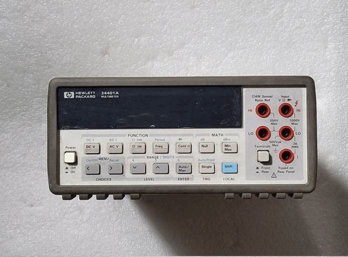
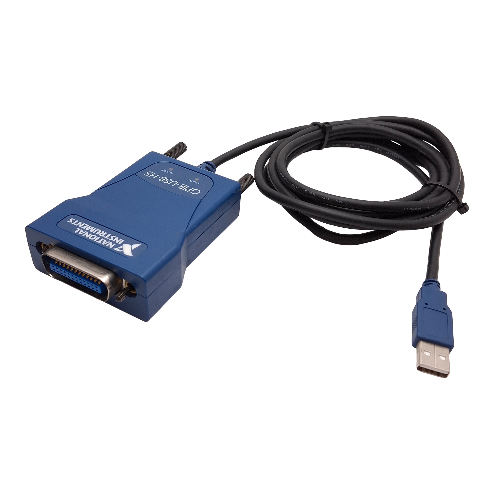
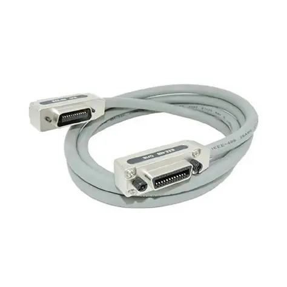
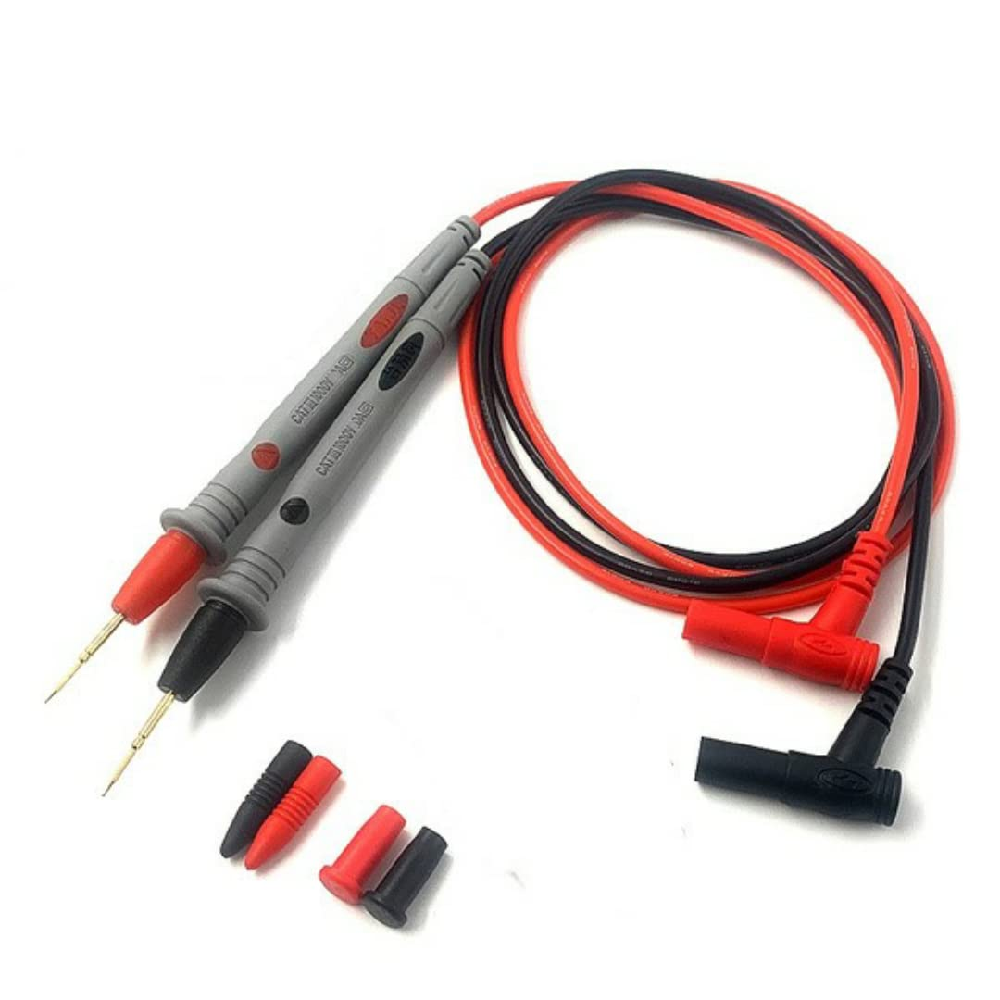

# DMM Control GUI — Engineering Spec-let

**Document type:** Lab-Automation Building Block Spec-let
**Building block:** DMM Control GUI (HP 34401A over GPIB)
**Status:** Draft
**Last updated:** 2026-06-04
**Author:** _TBD_

> **Image placeholders:** Throughout this document, `📷 [IMAGE: ...]` marks where a
> photo or screenshot should be inserted. Replace each with an actual image before
> publishing.

---

## Table of Contents
1. [Intro / Background / Scope](#1-intro--background--scope)
2. [Use Cases](#2-use-cases)
3. [Why It's Complicated](#3-why-its-complicated)
4. [How It's Currently Being Done (Full Capabilities)](#4-how-its-currently-being-done-full-capabilities)
5. [How It's Going To Be Done (Captured Capabilities)](#5-how-its-going-to-be-done-captured-capabilities)
6. [Boundaries](#6-boundaries)
7. [Requirements / Pre-requisites](#7-requirements--pre-requisites)
8. [Setup Steps](#8-setup-steps)
9. [How To Use It](#9-how-to-use-it)
10. [Common Errors](#10-common-errors)
11. [Protections](#11-protections-optional)
12. [Open Questions / Next Steps](#12-open-questions--next-steps)

---

## 1. Intro / Background / Scope

### Background
Bench digital multimeters (DMMs) like the **HP/Agilent 34401A** are workhorse lab
instruments, but by default they are operated by hand from the front panel and
read out one value at a time. For any measurement that needs to be **logged over
time, repeated reliably, or shared**, manual operation becomes the bottleneck.

The **DMM Control GUI** is a lab-automation building block: a desktop application
that connects to the 34401A over GPIB, configures it, streams live readings,
plots them, and exports the logged data to CSV/Excel.

### Scope
**In scope**
- Automated configuration and live acquisition from a single HP 34401A.
- Multiple measurement modes (DC/AC voltage, resistance, continuity, diode,
  frequency, period).
- Live numeric display, trend chart, running statistics, alarms.
- Data export to CSV and Excel (with embedded chart).

**Out of scope (current version)**
- Multi-instrument / multi-channel orchestration.
- Closed-loop control or automated pass/fail sequencing.
- Headless / scripted (no-GUI) operation.
- Instruments other than the 34401A (though the SCPI design is portable — TBD).

---

## 2. Use Cases

| # | Use Case | Description |
|---|----------|-------------|
| 1 | Power-rail logging | Monitor a DC voltage rail over minutes/hours, capture min/max/mean and drift. |
| 2 | Diode / junction check | Single-read forward voltage of a diode; verify ~0.55–0.8 V (Si) and `OL` reverse. |
| 3 | Continuity testing | Verify a trace/connection shows low resistance. |
| 4 | Resistance measurement | 2-wire resistance logging with NPLC/autozero for stability. |
| 5 | AC voltage monitoring | True-RMS AC voltage trend over time. |
| 6 | Frequency / period capture | Measure signal frequency or period using a gate (aperture) time. |
| 7 | Data hand-off | Export a timestamped run to Excel for analysis or reporting. |

---

## 3. Why It's Complicated

- **Instrument communication stack:** Talking to the 34401A requires a layered
  driver stack (NI-488.2 GPIB driver → NI-VISA → PyVISA → SCPI). Any missing
  layer produces cryptic failures.
- **SCPI quirks:** Function changes must be sequenced carefully (`*CLS`, `CONF`,
  `*OPC?`) or the meter parses sub-commands against the wrong function and lights
  the **ERR** annunciator. Range syntax is `<func>:RANG:AUTO ON|OFF` — the
  "obvious" `RANG AUTO` is invalid.
- **Per-mode capability differences:** Not all modes support the same controls
  (NPLC, autozero, aperture, range). The UI must enable/disable controls per mode.
- **Concurrency:** Acquisition runs on a background thread while Tkinter owns the
  UI thread. Sessions must be opened/closed cleanly so a restarting thread does
  not destroy a newer thread's instrument session.
- **Transient GPIB errors:** Occasional VISA timeouts require retry logic rather
  than aborting the run.
- **Overload / edge values:** Readings can come back as `OL` (overload) and must
  be handled gracefully in display, stats, and plotting.

---

## 4. How It's Currently Being Done (Full Capabilities)

The 34401A itself (and the current GUI) supports the following. This is the
**superset** of what the hardware can do.

### Measurement modes & controls

| Mode | Unit | Range control | NPLC | Autozero | Aperture |
|------|------|---------------|------|----------|----------|
| DC Voltage | V | Yes | Yes | Yes | — |
| AC Voltage | V | Yes | — | — | — |
| Resistance (2-wire) | Ω | Yes | Yes | Yes | — |
| Continuity | Ω | Fixed | — | — | — |
| Diode | V (Vf) | Fixed | — | — | — |
| Frequency | Hz | Yes | — | — | Yes |
| Period | s | Yes | — | — | Yes |

### Hardware capabilities (from 34401A datasheet — confirm against `e9d43e.pdf`)

| Capability | Value | Status |
|------------|-------|--------|
| Resolution | up to 6½ digits | confirm |
| DC Voltage ranges | 100 mV / 1 V / 10 V / 100 V / 1000 V | TBD — verify |
| AC Voltage ranges | 100 mV – 750 V | TBD — verify |
| Resistance ranges | 100 Ω – 100 MΩ | TBD — verify |
| Frequency range | 3 Hz – 300 kHz | TBD — verify |
| Reading rate (max) | up to ~1000 rdgs/s (low resolution) | TBD — verify |
| Interfaces | GPIB (HP-IB) and RS-232 | confirm |

### GUI capabilities (today)
- Live numeric display with unit and alarm color-coding.
- Live trend chart (rolling 300-point window).
- Running statistics: Count, Min, Max, Mean (per active mode).
- Configurable sample interval, NPLC, autozero, range/auto-range, aperture.
- Low/High alarm thresholds with enable toggle.
- Presets: Fast, Stable Precision, Diode Quick, AC Monitor, Frequency Gate.
- Single Read (one-shot) and continuous acquisition.
- Automatic mode-switch (reconfigures meter live when mode changes).
- CSV export and Excel export (with embedded line chart).

---

## 5. How It's Going To Be Done (Captured Capabilities)

This section describes how much of the full hardware capability the GUI building
block actually captures.

| Hardware capability | Captured by GUI? | Notes |
|---------------------|------------------|-------|
| DC Voltage | ✅ Full | Range, NPLC, autozero exposed |
| AC Voltage | ✅ Partial | Range only (no NPLC/autozero — not applicable) |
| Resistance (2-wire) | ✅ Full | Range, NPLC, autozero exposed |
| Resistance (4-wire) | ❌ Not yet | Not in mode table — TBD |
| DC Current | ❌ Not yet | Not implemented — TBD |
| AC Current | ❌ Not yet | Not implemented — TBD |
| Continuity | ✅ Full | Fixed-function |
| Diode | ✅ Full | Fixed-function |
| Frequency | ✅ Full | Aperture exposed |
| Period | ✅ Full | Aperture exposed |
| Max hardware reading rate | ⚠️ Limited | Effective rate = software interval + conversion time; raw rate not yet characterized (TBD) |
| Instrument reading buffer | ⚠️ Not used | Readings stored in PC memory, not instrument buffer |

**Summary:** The GUI captures the most common voltage/resistance/diagnostic modes
at moderate sample rates suitable for logging and monitoring. High-speed burst
capture, current modes, and 4-wire resistance are **not yet** implemented.

---

## 6. Boundaries

### Specifications Summary

| Parameter | Value |
|-----------|-------|
| Device | HP/Agilent 34401A (6½-digit DMM) |
| Interface | GPIB (IEEE-488), NI USB-GPIB adapter |
| Protocol | SCPI over NI-VISA |
| VISA resource | `GPIB0::6::INSTR` (default address 6) |
| Default sample interval | 0.5 s |
| Chart window | 300 points (`MAX_POINTS`) |
| Read retries | 3 (`MAX_RETRIES`) |
| Fastest sample rate (observed) | TBD — needs measurement |
| Slowest sample rate (observed) | TBD — needs measurement |
| Max test duration tested | TBD — needs measurement |

### Operating boundaries & limits

| Boundary | Limit | Limited by |
|----------|-------|------------|
| Sample interval | ≥ ~0.5 s default (configurable) | Software interval + NPLC/aperture conversion time |
| Max test duration | TBD | PC RAM (readings held in memory list) |
| Trend chart history | 300 most-recent points | `MAX_POINTS` (full data still logged) |
| Concurrent reads | 1 at a time | Single VISA session; Single Read blocked during continuous run |
| Instrument address | Fixed `GPIB0::6::INSTR` | Hardcoded `RESOURCE` constant |
| Overload | Returned as `OL`, plotted as 0 | Range too low for signal |

### Accuracy & resolution (per mode)

| Mode | Resolution | Accuracy | Status |
|------|-----------|----------|--------|
| DC Voltage | up to 6½ digits (NPLC dep.) | TBD | TBD — needs measurement |
| AC Voltage | TBD | TBD | TBD — needs measurement |
| Resistance | TBD | TBD | TBD — needs measurement |
| Frequency / Period | gate-time dep. (0.01/0.1/1.0 s → 4½/5½/6½ digits) | TBD | TBD — needs measurement |
| Diode | TBD | TBD | TBD — needs measurement |

---

## 7. Requirements / Pre-requisites

### 7.1 Hardware

| Item | Model / Spec | Notes |
|------|--------------|-------|
| Digital multimeter | HP/Agilent **34401A** | 6½-digit bench DMM, GPIB-capable |
| GPIB interface adapter | **NI GPIB-USB-HS** (or equivalent) | USB ↔ GPIB bridge |
| GPIB cable | IEEE-488 cable | Meter ↔ adapter |
| Host PC | Windows 10/11 | Tested with Python 3.10 |
| Test leads / DUT | Probes, diodes, resistors, etc. | Depends on measurement mode |

**Hardware photos (insert):**
- 📷 [IMAGE: HP 34401A front panel]

- 📷 [IMAGE: NI GPIB-USB-HS adapter]

- 📷 [IMAGE: IEEE-488 GPIB cable / connector]

- 📷 [IMAGE: Test leads / probes]


### 7.2 Software Tools

| Tool | Purpose | Where to get it |
|------|---------|-----------------|
| Python 3.10 (Windows) | Runtime for the GUI | https://www.python.org/downloads/ |
| NI-VISA | VISA instrument I/O layer | https://www.ni.com/en/support/downloads/drivers/download.ni-visa.html |
| NI-488.2 | GPIB driver (required for GPIB) | https://www.ni.com/en/support/downloads/drivers/download.ni-488-2.html |
| PyVISA | Python ↔ VISA binding | `pip install pyvisa` — https://pyvisa.readthedocs.io |
| matplotlib | Live trend chart | `pip install matplotlib` — https://matplotlib.org |
| openpyxl | Excel export | `pip install openpyxl` — https://openpyxl.readthedocs.io |

> **NI driver component selection:** During the NI-VISA and NI-488.2 installers,
> install the Runtime, Configuration Support, MAX support, and utilities. You can
> skip the .NET / C/C++ / Visual Basic development components — they are not needed
> for Python use. (See the original `USER_GUIDE.md` for the exact checklist.)

---

## 8. Setup Steps

📷 [IMAGE: Overall setup diagram — PC → USB → GPIB adapter → GPIB cable → 34401A]

### Step 1 — Configure the multimeter for GPIB
1. Power on the HP 34401A.
2. Press **Shift → I/O Menu**.
3. **2: INTERFACE** → set to `HP-IB / 488`.
4. **1: HP-IB ADDR** → set to `6` (suite default).
5. Connect the GPIB cable between the meter and the NI USB-GPIB adapter, then plug
   the adapter into the PC.

📷 [IMAGE: 34401A I/O menu showing HP-IB and address 6]

### Step 2 — Install NI drivers
1. Install **NI-VISA** (link in §7.2). Reboot.
2. Install **NI-488.2** (link in §7.2). Reboot.

### Step 3 — Verify the instrument in NI MAX
1. Open **NI MAX** (Measurement & Automation Explorer).
2. Expand **Devices and Interfaces** → confirm `GPIB0` appears.
3. Right-click `GPIB0` → **Scan for Instruments** → confirm the 34401A at
   address `6`.

📷 [IMAGE: NI MAX showing GPIB0 and the detected 34401A]

### Step 4 — Set up the Python environment
Run in PowerShell from the project folder:

```powershell
cd c:\DAQ-Automation\MultimeterAutomation\MultimeterAutomation
py -3.10 -m venv .venv
.\.venv\Scripts\python.exe -m pip install --upgrade pip pyvisa matplotlib openpyxl
```

> **Note:** The virtual environment must match an installed Python version. If
> `.venv` was built against a Python that is no longer installed, delete and
> rebuild it (`Remove-Item -Recurse -Force .venv` then recreate as above).

### Step 5 — Smoke-test the connection (optional but recommended)

```powershell
.\.venv\Scripts\python.exe import_pyvisa.py
```

Expected output:
```
VISA resources: ('ASRL3::INSTR', 'GPIB0::6::INSTR')
HEWLETT-PACKARD,34401A,0,7-5-2
DC voltage: +2.29700000E-05 V
...
```
Press `Ctrl+C` to stop.

---

## 9. How To Use It

### 🟢 TLDR — Quick Run
```powershell
cd c:\DAQ-Automation\MultimeterAutomation\MultimeterAutomation
.\.venv\Scripts\python.exe voltage_ui.py
```
Then in the window: pick **Mode** → (optional) **Apply Preset** → **Connect & Start**
→ **Stop** → **Export Excel/CSV**.

### Full step-by-step

1. **Launch the GUI:**
   ```powershell
   cd c:\DAQ-Automation\MultimeterAutomation\MultimeterAutomation
   .\.venv\Scripts\python.exe voltage_ui.py
   ```
   The dark-themed **"HP 34401A Measurement Console"** window opens.

   📷 [IMAGE: GUI main window]

2. **Choose a measurement mode** from the **Mode** dropdown (DC Voltage, AC
   Voltage, Resistance, Continuity, Diode, Frequency, Period). Controls that don't
   apply to the mode are disabled automatically.

3. **Configure settings (optional):**
   - **Sample interval (s):** time between readings (e.g. 0.2–1.0 s).
   - **NPLC:** integration cycles — lower = faster/noisier, higher = slower/cleaner.
   - **Autozero:** on for best DC/resistance accuracy.
   - **Auto range / Range:** auto, or uncheck and enter a fixed range (e.g. `10`).
   - **Aperture (s):** gate time for Frequency/Period (0.01 / 0.1 / 1.0).
   - **Low/High alarm + Enable alarm:** flags out-of-limit readings in red.

4. **Or apply a Preset:** select one (Fast, Stable Precision, Diode Quick,
   AC Monitor, Frequency Gate) and click **Apply Preset**.

5. **Start acquiring:** click **Connect & Start**. The live value, statistics, and
   trend chart update in real time. Status shows the connected `*IDN?` string.

6. **Single spot check (alternative):** with acquisition stopped, click
   **Single Read** for one reading.

7. **Switch modes on the fly:** changing the Mode dropdown while running clears the
   chart/history, reconfigures the meter, and resumes automatically — no manual
   stop/start needed.

8. **Stop** when done.

9. **Export data:**
   - **Export CSV** → columns `Mode, Timestamp, Reading, Settings`.
   - **Export Excel** → `Readings` sheet + `Chart` sheet with an embedded line
     chart.
   - **Clear Data** resets chart, stats, and history.

   📷 [IMAGE: Example exported Excel with chart]

### Example workflows
- **Log a DC rail:** Mode = DC Voltage → Apply preset `Stable Precision` →
  (optional Range = 10) → Connect & Start → Stop → Export Excel.
- **Test a diode:** Mode = Diode → red lead to anode, black to cathode →
  Single Read (~0.55–0.8 V good; reverse leads → `OL`).
- **Check continuity:** Mode = Continuity → Connect & Start → probe two points
  (low Ω = good).
- **Measure frequency:** Mode = Frequency → Aperture = 0.1 → connect signal →
  Connect & Start.

---

## 10. Common Errors

| Error / Symptom | Cause | Fix |
|-----------------|-------|-----|
| `did not find executable at '...Python314\python.exe'` | `.venv` built against a Python version no longer installed | Delete and rebuild `.venv` with an installed Python (see §8 Step 4) |
| `Could not locate a VISA implementation` | NI-VISA not installed | Install NI-VISA, reboot |
| `No module named 'gpib'` / `VI_ERROR_LIBRARY_NFOUND` | NI-488.2 (GPIB driver) missing | Install NI-488.2, reboot |
| `VI_ERROR_TMO` (timeout) | Transient GPIB hiccup | GUI retries up to 3×; reseat cable, lower sample rate if persistent |
| `GPIB0::6::INSTR` not found | Wrong address or meter not in HP-IB mode | Confirm address `6` in NI MAX; check meter I/O settings; update `RESOURCE` if needed |
| UI shows `ERROR` after Start | Address mismatch / meter offline | Verify in NI MAX; confirm cable and power |
| `OL` in display | Signal exceeds active range | Use auto range or a higher fixed range |
| ERR annunciator on meter | Invalid SCPI sequence (legacy) | Current code clears with `*CLS`/`*OPC?`; if seen, restart acquisition |
| Excel export fails | `openpyxl` not installed | `pip install openpyxl` in the venv |
| Normal reading shows red | Alarm enabled with wrong thresholds | Disable alarm or fix low/high values |

📷 [IMAGE: Example error dialog / status bar message]

---

## 11. Protections (Optional)

> Document any electrical/operational protections. Confirm hardware-specific
> values against `e9d43e.pdf` before relying on them.

### Software / operational protections (implemented)
- **Overload handling:** `OL` readings are detected and displayed safely (plotted
  as 0, not crashed).
- **Retry on transient faults:** up to 3 retries with buffer clear on VISA errors.
- **Alarm thresholds:** optional low/high limits visually flag out-of-range values.
- **Clean session handling:** background thread opens/closes its own VISA session
  and won't clobber a newer session on restart.

### Instrument input protection (34401A — verify against datasheet)
| Terminal / Mode | Max input | Status |
|-----------------|-----------|--------|
| Voltage input (HI–LO) | up to 1000 V DC / 750 V AC | TBD — verify |
| Current input (if used) | fused (e.g. 3 A / 250 V) | TBD — verify (current modes not yet in GUI) |
| Input overvoltage cat. | per datasheet | TBD — verify |

> ⚠️ **Operator safety:** Do not exceed the 34401A's rated input limits. Confirm
> ranges and terminal ratings in the official manual before high-voltage or
> current measurements. Current measurement modes are **not yet implemented** in
> the GUI.

---

## 12. Open Questions / Next Steps
1. **Characterize sampling rate** (fastest/slowest stable per mode) and record units.
2. **Duration limit test** — find practical max run length; consider streaming to
   disk for long captures instead of holding all readings in memory.
3. **Confirm ranges/accuracy/protection** from `e9d43e.pdf` and replace TBD rows.
4. **Add missing modes** — DC/AC current and 4-wire resistance.
5. **Parameterize the VISA address** (remove hardcoded `GPIB0::6::INSTR`).
6. **Define a headless/API mode** so a test sequencer can drive the block.
7. **Insert all images** marked `📷 [IMAGE: ...]`.

> **Legend:** _TBD — needs measurement_ = obtain empirically; _TBD — needs
> verification_ = expected from datasheet but not yet confirmed.
